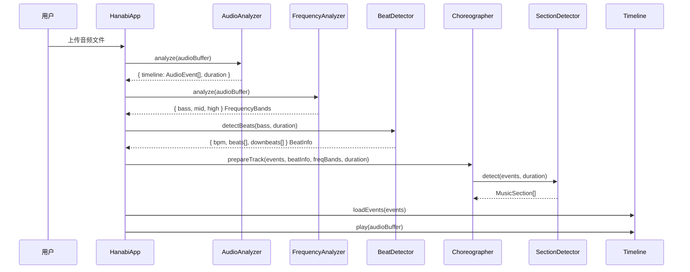
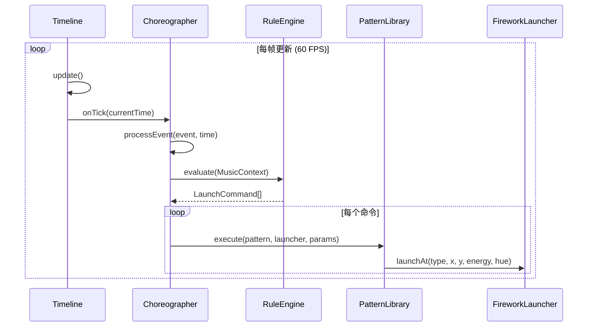
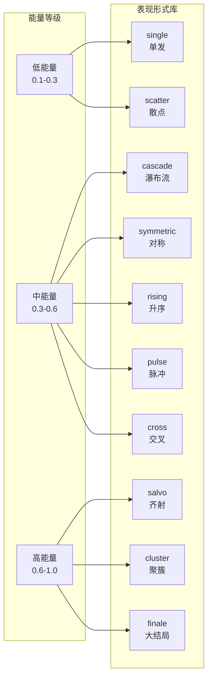
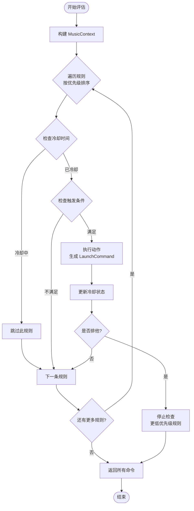

# 烟花艺术表演系统 - 编排设计文档

## 概述

本系统实现了一套完整的音乐-烟花映射编排系统，将音乐特征精细映射到不同的烟花表现形式，实现专业级的音乐同步烟花表演。

---

## 一、系统架构

### 1.1 模块结构

```
src/choreography/
├── Choreographer.ts      # 主编排引擎 - 整合所有组件
├── PatternLibrary.ts     # 表现形式库 - 10种烟花艺术模式
├── RuleEngine.ts         # 规则引擎 - 优先级决策系统
├── SectionDetector.ts    # 段落检测 - 音乐结构分析
└── index.ts              # 模块导出
```

### 1.2 系统架构图

```
┌─────────────────────────────────────────────────────────────────┐
│                         HanabiApp (main.ts)                     │
├─────────────────────────────────────────────────────────────────┤
│                                                                 │
│   ┌──────────────┐    ┌──────────────┐    ┌──────────────┐     │
│   │AudioAnalyzer │    │FrequencyAna- │    │ BeatDetector │     │
│   │   (事件)     │    │lyzer (频谱)  │    │   (节拍)     │     │
│   └──────┬───────┘    └──────┬───────┘    └──────┬───────┘     │
│          │                   │                   │              │
│          └───────────────────┼───────────────────┘              │
│                              ▼                                  │
│                    ┌─────────────────┐                          │
│                    │  Choreographer  │                          │
│                    │   (主编排器)    │                          │
│                    └────────┬────────┘                          │
│                             │                                   │
│          ┌──────────────────┼──────────────────┐                │
│          ▼                  ▼                  ▼                │
│   ┌──────────────┐  ┌──────────────┐  ┌──────────────┐         │
│   │SectionDetec- │  │ RuleEngine   │  │PatternLibrary│         │
│   │tor (段落)    │  │ (规则引擎)   │  │ (表现形式)   │         │
│   └──────────────┘  └──────────────┘  └──────────────┘         │
│                             │                                   │
│                             ▼                                   │
│                    ┌─────────────────┐                          │
│                    │FireworkLauncher │                          │
│                    │   (烟花发射)    │                          │
│                    └─────────────────┘                          │
│                                                                 │
└─────────────────────────────────────────────────────────────────┘
```

---

## 二、数据流程

### 2.1 音频分析时序图



### 2.2 实时播放时序图



---

## 三、烟花艺术表现形式

### 3.1 十种表现形式

| 编号 | 名称 | 英文名 | 视觉效果 | 适用音乐场景 |
|-----|------|--------|---------|-------------|
| 1 | 单发 | single | 单个绽放，干净优雅 | 钢琴音符、旋律重音 |
| 2 | 齐射 | salvo | 密集爆炸填满天空 | 高潮、鼓点密集段 |
| 3 | 瀑布流 | cascade | 从左到右依次绽放 | 琶音、旋律流动 |
| 4 | 对称双发 | symmetric | 左右镜像同步爆炸 | 副歌、和声段落 |
| 5 | 升序阶梯 | rising | 高度逐渐上升 | 渐强、上行旋律 |
| 6 | 节拍脉冲 | pulse | 与节拍精确同步 | 鼓点、强节奏段 |
| 7 | 聚簇爆发 | cluster | 同位置多发混色 | 重音、交响打击 |
| 8 | 交叉对角 | cross | X形或菱形图案 | 桥段、转调处 |
| 9 | 稀疏散点 | scatter | 柔和随机光点 | 安静段、前奏尾声 |
| 10 | 大结局 | finale | 最大强度满屏爆炸 | 终曲高潮、歌曲结尾 |

### 3.2 表现形式流程图



---

## 四、规则引擎

### 4.1 规则优先级

```
优先级 100: 大结局 (finale)
    ↓ 触发条件: 歌曲最后10秒 + 能量>0.6
优先级 90: 高潮齐射 (climax_salvo)
    ↓ 触发条件: 进入高潮段 + bass事件 + isClimax
优先级 85: 节拍落点 (beat_drop)
    ↓ 触发条件: 安静后第一个重拍
优先级 80: 段落过渡 (section_transition)
    ↓ 触发条件: 进入新段落0.5s内
优先级 70: 副歌对称 (chorus_symmetric)
    ↓ 触发条件: 副歌段 + bass + 能量>0.5
优先级 60: 钢琴卡点 (piano_beat_sync)
    ↓ 触发条件: 钢琴音符与节拍偏移<50ms
优先级 50: 低音冲击 (bass_impact)
    ↓ 触发条件: bass事件 + 能量>0.4
优先级 40: 中频点缀 (mid_accent)
    ↓ 触发条件: mid事件 + 能量>0.3
优先级 20: 氛围散点 (ambient_scatter)
    ↓ 触发条件: 钢琴 + 非高潮 + 能量<0.3
```

### 4.2 规则评估流程



---

## 五、音乐段落检测

### 5.1 段落类型

| 段落类型 | 检测特征 | 主要表现形式 | 能量范围 |
|---------|---------|-------------|---------|
| intro | 低能量开场，位置<15% | scatter, single | 0.1-0.3 |
| verse | 中等稳定能量 | single, pulse | 0.3-0.5 |
| prechorus | 能量上升趋势 | rising, cascade | 0.5-0.7 |
| chorus | 高能量，事件密集 | symmetric, salvo | 0.6-0.9 |
| bridge | 能量变化，位置居中 | cross, cascade | 0.4-0.7 |
| climax | 最高能量，多climax事件 | salvo, finale | 0.8-1.0 |
| outro | 能量衰减，位置>85% | scatter→single | 0.3→0.1 |

### 5.2 段落检测流程

```mermaid
flowchart TD
    Input[输入: AudioEvent[]] --> Windows[创建分析窗口<br/>默认4秒/窗口]
    Windows --> Metrics[计算窗口指标<br/>平均能量/事件数/高潮数]
    Metrics --> Trends[计算能量趋势<br/>rising/falling/stable]
    Trends --> Classify[分类窗口类型]

    subgraph Classification ["分类逻辑"]
        C1{climaxCount>2 或<br/>能量>高阈值}
        C1 -->|是| Climax[climax]
        C1 -->|否| C2{能量>中高阈值<br/>且事件>5}
        C2 -->|是| Chorus[chorus]
        C2 -->|否| C3{趋势=rising<br/>且能量>平均}
        C3 -->|是| PreChorus[prechorus]
        C3 -->|否| C4{能量<低阈值<br/>或事件<2}
        C4 -->|是| CheckPos[检查位置]
        CheckPos -->|<15%| Intro[intro]
        CheckPos -->|>85%| Outro[outro]
        CheckPos -->|其他| Bridge[bridge]
        C4 -->|否| Verse[verse]
    end

    Classify --> Merge[合并相邻同类段落]
    Merge --> MinDur[应用最小时长约束<br/>默认8秒]
    MinDur --> Output[输出: MusicSection[]]
```

---

## 六、关键数据结构

### 6.1 MusicContext (规则评估上下文)

```typescript
interface MusicContext {
  currentTime: number;        // 当前播放时间
  currentEvent: AudioEvent;   // 当前处理的事件
  currentSection: MusicSection | null;  // 当前音乐段落
  beatInfo: BeatInfo | null;  // 节拍信息
  duration: number;           // 音乐总时长
  screenWidth: number;        // 屏幕宽度
  screenHeight: number;       // 屏幕高度
  recentEvents: AudioEvent[]; // 最近2秒内的事件
}
```

### 6.2 LaunchCommand (发射指令)

```typescript
interface LaunchCommand {
  pattern: PatternType;       // 表现形式类型
  launchTime: number;         // 发射时间
  params: {
    duration: number;
    targetY: number;          // 目标高度
    count?: number;           // 烟花数量
    x?: number;               // 发射位置X
    hue?: number;             // 色相
    type?: FireworkType;      // 烟花类型
    direction?: 'left' | 'right' | 'center' | 'outward';
    spread?: number;          // 扩散范围
    interval?: number;        // 间隔时间(ms)
    energy?: number;          // 能量等级
  };
}
```

### 6.3 ChoreographyRule (编排规则)

```typescript
interface ChoreographyRule {
  id: string;                 // 规则唯一标识
  priority: number;           // 优先级 (0-100)
  cooldown: number;           // 冷却时间 (秒)
  exclusive: boolean;         // 是否排他
  condition: (ctx: MusicContext) => boolean;  // 触发条件
  action: (ctx: MusicContext) => LaunchCommand | null;  // 执行动作
}
```

---

## 七、使用示例

### 7.1 基本使用

```typescript
// 1. 创建编排器
const choreographer = new Choreographer();
choreographer.setLauncher(fireworkLauncher);

// 2. 准备轨道数据
choreographer.prepareTrack({
  events: audioEvents,
  beatInfo: beatDetectionResult,
  freqBands: frequencyBands,
  duration: audioDuration,
});

// 3. 在播放循环中更新
function animate(time: number) {
  choreographer.update(time);
  requestAnimationFrame(animate);
}
```

### 7.2 手动触发模式

```typescript
// 手动触发特定表现形式
choreographer.triggerPattern('salvo', {
  count: 20,
  energy: 0.8,
});

// 触发大结局
choreographer.triggerPattern('finale', {
  energy: 1.0,
});
```

---

## 八、扩展指南

### 8.1 添加新的表现形式

1. 在 `PatternLibrary.ts` 中创建新的 Pattern 类:

```typescript
class MyPattern implements Pattern {
  execute(launcher: FireworkLauncher, params: PatternParams): void {
    // 实现发射逻辑
  }
}
```

2. 在 `registerBuiltinPatterns()` 中注册:

```typescript
this.patterns.set('mypattern', new MyPattern());
```

3. 在 `types.ts` 的 `PatternType` 中添加类型定义

### 8.2 添加新的规则

在 `RuleEngine.ts` 的 `registerDefaultRules()` 中添加:

```typescript
this.addRule({
  id: 'my_rule',
  priority: 55,  // 设定优先级
  cooldown: 1.0, // 冷却1秒
  exclusive: false,
  condition: (ctx) => {
    // 返回 true/false
    return ctx.currentEvent.type === 'bass' && ctx.currentEvent.energy > 0.5;
  },
  action: (ctx) => ({
    pattern: 'mypattern',
    launchTime: ctx.currentTime,
    params: {
      duration: 0,
      targetY: ctx.screenHeight * 0.25,
      energy: ctx.currentEvent.energy,
    },
  }),
});
```

---

## 九、性能考虑

- **规则评估**: O(n) 每帧，n为规则数量
- **段落检测**: O(m) 预计算，m为分析窗口数
- **命令调度**: 使用队列管理，避免同帧大量发射
- **冷却机制**: 防止规则过度触发，保持视觉节奏

---

## 十、文件清单

### 新增文件
| 文件路径 | 说明 |
|---------|------|
| `src/choreography/Choreographer.ts` | 主编排引擎 |
| `src/choreography/PatternLibrary.ts` | 10种表现形式 |
| `src/choreography/SectionDetector.ts` | 段落检测 |
| `src/choreography/RuleEngine.ts` | 规则引擎 |
| `src/choreography/index.ts` | 模块导出 |

### 修改文件
| 文件路径 | 修改内容 |
|---------|---------|
| `src/engine/FireworkLauncher.ts` | 添加 launchAt()、launchMultiple() |
| `src/audio/Timeline.ts` | 添加 onTick 回调 |
| `src/core/types.ts` | 添加 PatternType、SectionType 等类型 |
| `src/main.ts` | 集成 Choreographer |
