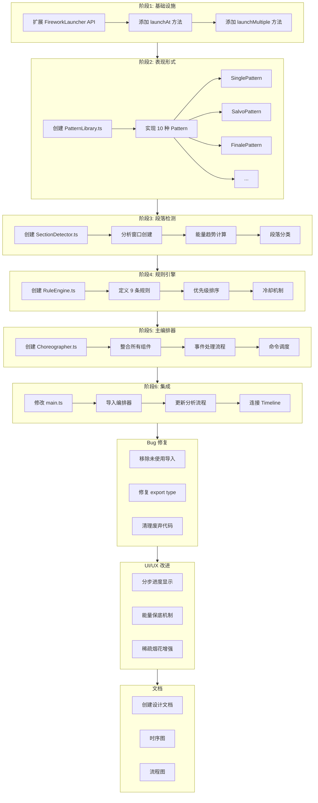
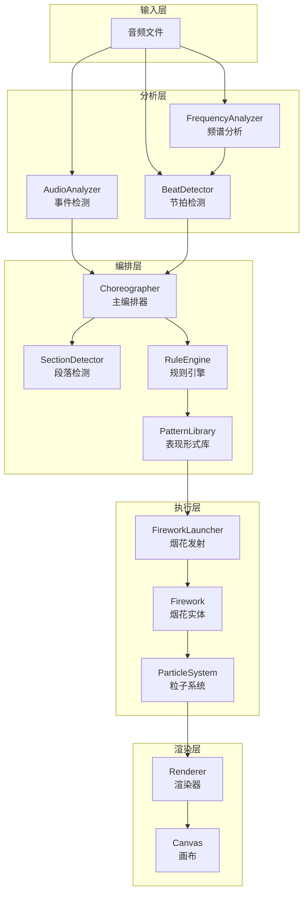
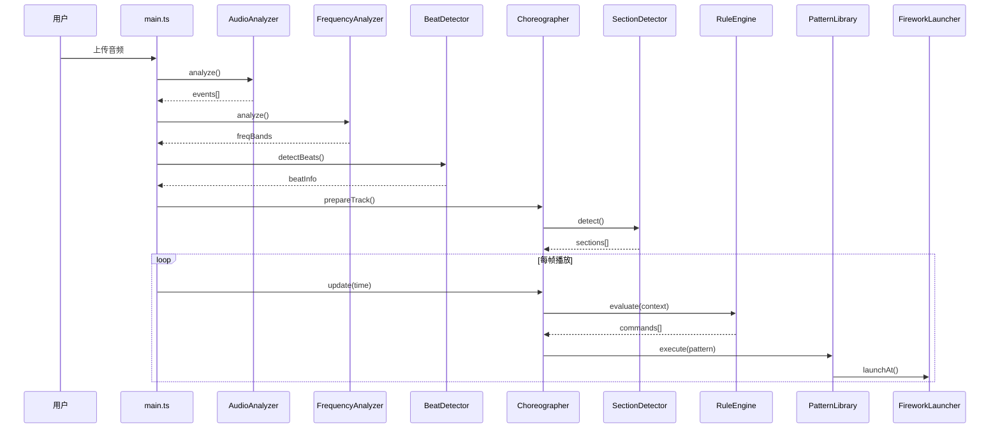
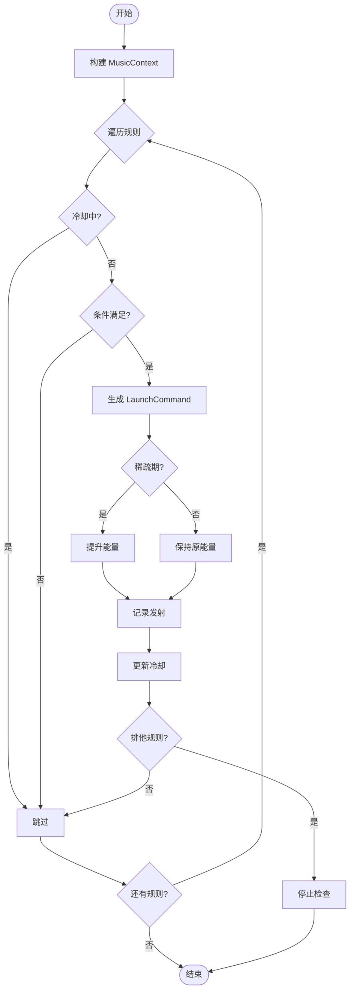
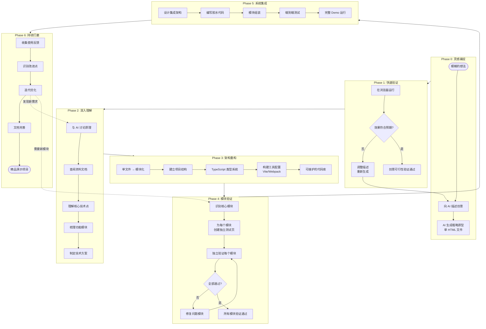
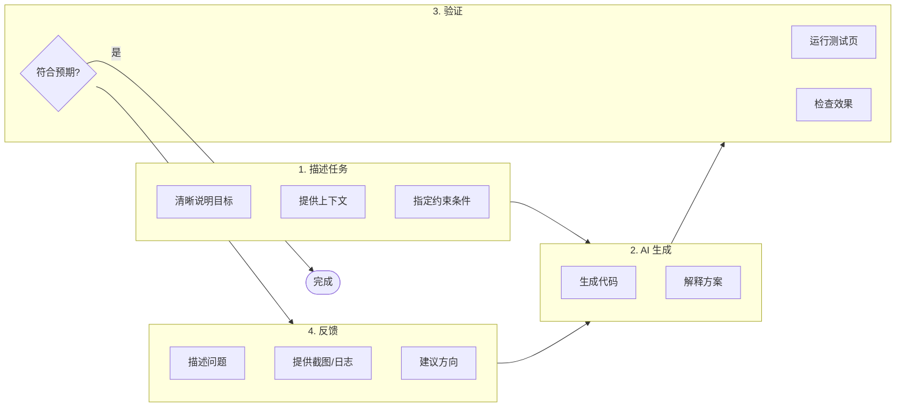
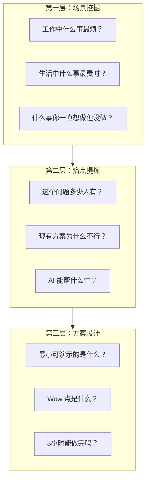
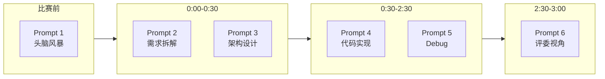
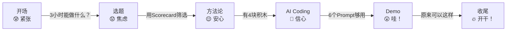

# 烟花艺术表演系统 - 开发日志

## 概述

本文档记录了烟花艺术表演系统（音乐-烟花编排系统）的完整开发过程，包括功能研发、Bug修复、UI/UX改进等。

---

## 一、功能研发 (Feature Development)

### 1.1 阶段1：扩展发射器 API

**目标**: 为编排系统提供更精细的烟花发射控制

**修改文件**: `src/engine/FireworkLauncher.ts`

**新增方法**:
```typescript
// 精确控制发射位置、能量、色相
launchAt(type, x, targetY, energy, hue, instant?)

// 批量发射
launchMultiple(configs: LaunchConfig[])

// 获取屏幕尺寸（供Pattern使用）
getScreenWidth()
getScreenHeight()
```

---

### 1.2 阶段2：创建表现形式库

**目标**: 实现10种专业烟花艺术表现形式

**新增文件**: `src/choreography/PatternLibrary.ts`

**实现的模式**:

| 模式 | 类名 | 视觉效果 |
|-----|------|---------|
| 单发 | SinglePattern | 单个绽放，干净优雅 |
| 齐射 | SalvoPattern | 密集爆炸填满天空 |
| 瀑布流 | CascadePattern | 从左到右依次绽放 |
| 对称双发 | SymmetricPattern | 左右镜像同步 |
| 升序阶梯 | RisingPattern | 高度逐渐上升 |
| 节拍脉冲 | PulsePattern | 与节拍同步 |
| 聚簇爆发 | ClusterPattern | 同位置多发混色 |
| 交叉对角 | CrossPattern | X形图案 |
| 稀疏散点 | ScatterPattern | 柔和随机光点 |
| 大结局 | FinalePattern | 满屏爆炸 |

---

### 1.3 阶段3：创建段落检测器

**目标**: 自动分析音乐结构，识别段落类型

**新增文件**: `src/choreography/SectionDetector.ts`

**功能**:
- 创建分析窗口（默认4秒/窗口）
- 计算能量趋势（rising/falling/stable）
- 分类段落类型（intro/verse/chorus/climax等）
- 合并相邻同类段落
- 应用最小时长约束

---

### 1.4 阶段4：创建规则引擎

**目标**: 实现优先级驱动的编排决策系统

**新增文件**: `src/choreography/RuleEngine.ts`

**默认规则集（9条）**:

| 优先级 | 规则ID | 触发条件 |
|-------|--------|---------|
| 100 | finale | 最后10秒 + 能量>0.6 |
| 90 | climax_salvo | 高潮段 + bass + isClimax |
| 85 | beat_drop | 安静后首个重拍 |
| 80 | section_transition | 段落开始0.5s内 |
| 70 | chorus_symmetric | 副歌 + bass + 能量>0.5 |
| 60 | piano_beat_sync | 钢琴与节拍偏移<50ms |
| 50 | bass_impact | bass + 能量>0.4 |
| 40 | mid_accent | mid + 能量>0.3 |
| 20 | ambient_scatter | 钢琴 + 非高潮 + 能量<0.3 |

---

### 1.5 阶段5：创建主编排器

**目标**: 整合所有组件，实现完整编排流程

**新增文件**: `src/choreography/Choreographer.ts`

**核心功能**:
- `prepareTrack()`: 预处理音轨数据
- `update()`: 实时更新（每帧调用）
- `processEvent()`: 处理音频事件
- `executeCommand()`: 执行发射指令

---

### 1.6 阶段6：集成到主页

**目标**: 将编排系统接入主应用

**修改文件**: `src/main.ts`

**修改内容**:
- 导入 Choreographer、FrequencyAnalyzer、BeatDetector
- 创建编排器实例并连接发射器
- 更新音频上传流程（3步分析）
- 使用 `onTick` 回调驱动编排更新

---

### 1.7 能量保底机制

**目标**: 解决稀疏烟花太小的问题

**修改文件**: `src/choreography/Choreographer.ts`

**实现逻辑**:
```typescript
// 配置
launchTrackingWindow = 3  // 追踪窗口（秒）
minEnergyFloor = 0.55     // 最低能量
sparseThreshold = 3       // 稀疏阈值

// 算法
if (最近3秒内烟花数 <= 3) {
  boostFactor = 1 + (3 - 烟花数) * 0.15
  energy = max(0.55, 原能量 * boostFactor)
}
```

---

## 二、Bug 修复 (Bug Fixes)

### 2.1 TypeScript 未使用导入错误

**问题**: `PatternParams` 在 RuleEngine.ts 中导入但未使用

**错误信息**:
```
src/choreography/RuleEngine.ts(9,1): error TS6133: 'PatternParams' is declared but its value is never read.
```

**修复**: 移除未使用的导入
```typescript
// 修复前
import { PatternParams } from './PatternLibrary';

// 修复后
// (已删除)
```

---

### 2.2 TypeScript isolatedModules 导出错误

**问题**: 在 isolatedModules 模式下重新导出类型需要使用 `export type`

**错误信息**:
```
src/choreography/index.ts(1,25): error TS1205: Re-exporting a type when 'isolatedModules' is enabled requires using 'export type'.
```

**修复**: 使用 `export type` 语法
```typescript
// 修复前
export { Choreographer, TrackData } from './Choreographer';

// 修复后
export { Choreographer } from './Choreographer';
export type { TrackData } from './Choreographer';
```

---

### 2.3 main.ts 未使用变量

**问题**: 移除旧事件处理函数后，`random` 导入不再使用

**修复**: 移除未使用的导入
```typescript
// 修复前
import { random } from '@/utils/math';

// 修复后
// (已删除)
```

---

## 三、UI/UX 改进 (UI/UX Improvements)

### 3.1 音频分析进度显示优化

**修改文件**: `src/main.ts`

**改进内容**:
- 分步显示分析进度（1/3, 2/3, 3/3）
- 显示当前分析阶段名称
- 播放时显示 BPM 信息

```typescript
// 显示示例
"分析音频事件... (1/3)"
"分析频率特征... (2/3)"
"检测节拍... (3/3)"
"正在播放: song.mp3 | BPM: 120"
```

---

### 3.2 稀疏烟花视觉增强

**问题**: 开场和中间稀疏时烟花太小，视觉效果差

**修改文件**:
- `src/choreography/Choreographer.ts`
- `src/choreography/PatternLibrary.ts`
- `src/choreography/RuleEngine.ts`

**改进内容**:

| 位置 | 原值 | 新值 | 效果 |
|-----|-----|-----|------|
| ScatterPattern | `random(0.2, 0.4)` | `max(0.35, baseEnergy * random(0.8, 1.2))` | 散点烟花更大 |
| piano_beat_sync | `energy * 0.6` | `max(0.5, energy * 0.9)` | 钢琴卡点更明显 |
| ambient_scatter | `0.25` | `0.45` | 背景填充更可见 |
| Choreographer | 无保底 | 稀疏时自动提升至0.55 | 单发不会太小 |

---

## 四、文档创建 (Documentation)

### 4.1 编排系统设计文档

**新增文件**: `docs/choreography-design.md`

**内容**:
- 系统架构图
- 数据流时序图
- 10种表现形式说明
- 规则优先级表
- 段落检测流程
- 关键数据结构
- 使用示例
- 扩展指南

---

### 4.2 文档维护（工程最佳实践补充）

**更新文件**:
- `README.md`
- `AGNET.md`
- `docs/PROJECT_HANDOVER.md`

**补充内容**:
- Node 版本与包管理器约束
- `node_modules` 管理与可复现安装
- 多项目复用建议（workspaces/包发布）

---

## 五、类型定义扩展 (Type Definitions)

**修改文件**: `src/core/types.ts`

**新增类型**:
```typescript
// 表现形式类型
type PatternType = 'single' | 'salvo' | 'cascade' | ...

// 段落类型
type SectionType = 'intro' | 'verse' | 'chorus' | ...

// 音乐段落
interface MusicSection { type, startTime, endTime, energy, density }

// 发射指令
interface LaunchCommand { pattern, launchTime, params }

// 发射配置
interface LaunchConfig { type, x, targetY, energy, hue, instant?, delay? }
```

---

## 六、文件变更总结

### 新增文件（6个）

| 文件路径 | 行数 | 说明 |
|---------|------|------|
| `src/choreography/Choreographer.ts` | ~280 | 主编排引擎 |
| `src/choreography/PatternLibrary.ts` | ~385 | 10种表现形式 |
| `src/choreography/SectionDetector.ts` | ~265 | 段落检测 |
| `src/choreography/RuleEngine.ts` | ~375 | 规则引擎 |
| `src/choreography/index.ts` | ~8 | 模块导出 |
| `docs/choreography-design.md` | ~350 | 设计文档 |

### 修改文件（4个）

| 文件路径 | 修改类型 |
|---------|---------|
| `src/engine/FireworkLauncher.ts` | 新增方法 |
| `src/audio/Timeline.ts` | 新增 onTick 回调 |
| `src/core/types.ts` | 新增类型定义 |
| `src/main.ts` | 集成编排器 |

---

## 七、开发流程图



---

## 八、系统架构图



---

## 九、数据流时序图



---

## 十、规则评估流程图



---

## 十一、从创意到落地：AI 驱动的项目迭代方法论

### 核心理念

本项目展示了一种 **AI 驱动的快速原型迭代方法**：从模糊的创意想法出发，通过 AI 辅助快速验证、模块化拆解、独立测试、最终集成的方式，将创意落地为可持续迭代的演示项目。

### 迭代阶段说明

| 阶段 | 目标 | 方法 | 产出 |
|-----|------|------|------|
| **Phase 0** | 灵感捕捉 | 描述想法给 AI | 粗略原型 (单文件) |
| **Phase 1** | 快速验证 | AI 生成可运行代码 | 能跑的 Demo |
| **Phase 2** | 深入理解 | 与 AI 讨论原理、查资料 | 技术方案 |
| **Phase 3** | 架构重构 | 单文件 → 模块化项目 | 可维护代码库 |
| **Phase 4** | 模块验证 | 每个模块独立测试页 | 验证通过的组件 |
| **Phase 5** | 系统集成 | 组装所有模块 | 完整 Demo |
| **Phase 6** | 持续打磨 | 迭代优化细节 | 精品演示 |

### 本项目的实际迭代历程

```
烟花项目迭代历程:

[想法] "想做一个音乐同步的烟花表演"
    ↓
[Phase 0] AI 生成单个 HTML 文件 (约1000行)
    ↓
[Phase 1] 在浏览器中看到烟花效果，验证可行性
    ↓
[Phase 2] 讨论: 烟花物理、粒子系统、音频分析、FFT 算法...
    ↓
[Phase 3] 重构为 TypeScript + Vite 项目
          ├── src/core/      (核心实体)
          ├── src/engine/    (引擎)
          ├── src/audio/     (音频分析)
          └── src/utils/     (工具函数)
    ↓
[Phase 4] 创建独立测试页面
          ├── /firework-types    → 验证4种烟花类型
          ├── /particle-physics  → 验证粒子物理
          ├── /audio-analyzer    → 验证音频分析
          ├── /renderer-debug    → 验证渲染器
          └── /launcher-test     → 验证发射器
    ↓
[Phase 5] 集成编排系统 (Choreographer)
          ├── PatternLibrary   (10种表现形式)
          ├── SectionDetector  (段落检测)
          ├── RuleEngine       (规则引擎)
          └── 主页集成
    ↓
[Phase 6] 持续打磨
          ├── 修复稀疏烟花太小
          ├── 优化能量保底
          └── 完善文档
```

### 完整迭代流程图



### 关键原则

#### 1. 快速验证优先
```
不要一开始就追求完美架构
先用 AI 生成能跑的代码，验证想法是否可行
```

#### 2. 模块化是迭代的基础
```
单文件原型 → 模块化项目

好处:
- 每个模块可独立测试
- AI 更容易理解和修改小模块
- 出问题时容易定位
- 便于团队协作
```

#### 3. 独立测试页是验证利器
```
为什么需要独立测试页?

┌─────────────────────────────────────────────────────┐
│  问题: 功能太多，难以确定 AI 改动是否正确          │
├─────────────────────────────────────────────────────┤
│  解决: 每个模块一个测试页，独立验证                │
│                                                     │
│  /firework-types   → 只测烟花类型，排除其他干扰    │
│  /audio-analyzer   → 只测音频分析，结果可视化      │
│  /particle-physics → 只测粒子物理，参数可调        │
└─────────────────────────────────────────────────────┘
```

#### 4. 验证通过再集成
```
错误做法:
  让 AI 一次性改很多文件 → 出问题不知道哪里错

正确做法:
  模块A验证 ✓ → 模块B验证 ✓ → 模块C验证 ✓ → 集成
```

#### 5. 持续迭代闭环
```
使用 → 发现问题 → 描述给 AI → 修复 → 验证 → 使用
  ↑                                              │
  └──────────────────────────────────────────────┘
```

### 本项目的模块验证矩阵

| 测试页 | 验证内容 | 可调参数 | 验证方式 |
|-------|---------|---------|---------|
| `/firework-types` | 4种烟花类型 | 类型选择 | 视觉对比 |
| `/particle-physics` | 粒子物理参数 | 摩擦力/重力/衰减 | 实时调整 |
| `/audio-analyzer` | 音频分析 | 阈值/灵敏度 | 波形可视化 |
| `/renderer-debug` | 渲染器 | 混合模式/背景 | 帧率监控 |
| `/launcher-test` | 发射器 | 位置/能量/色相 | 手动触发 |

### 与 AI 协作的最佳实践



---

## 十二、AI Coding Hackathon 分享设计（30分钟版）

### 赛题解读

```
┌─────────────────────────────────────────────────────────────────┐
│                    TRAE 开发应用 - 两大赛道                      │
├─────────────────────────────────────────────────────────────────┤
│                                                                 │
│  🔧 效率工具新想象                 🎨 创意开发新可能             │
│  ─────────────────                 ─────────────────             │
│  面向：工作场景                    面向：生活场景                │
│  目标：提升任务完成效率            目标：探索 AI 应用多元可能    │
│                                                                 │
│  示例方向：                        示例方向：                    │
│  • 会议纪要自动整理                • 音乐可视化                  │
│  • 代码 Review 助手                • AI 故事生成器               │
│  • 文档智能问答                    • 个性化推荐                  │
│  • 日程智能规划                    • 创意内容生成                │
│                                                                 │
└─────────────────────────────────────────────────────────────────┘
```

---

### 一、如何发掘想法？

#### 想法发掘的 3 层结构



#### 想法发掘 Prompt（对话式头脑风暴）

```markdown
【Prompt 1：场景发掘】

我要参加一个 3 小时的 AI Hackathon，赛道是：
- 效率工具：面向工作场景，提升任务完成效率
- 创意开发：面向生活场景，探索 AI 应用多元可能

请帮我头脑风暴 10 个项目想法，要求：
1. 每个想法用一句话描述
2. 说明它解决什么痛点
3. 说明 AI 在其中扮演什么角色
4. 评估 3 小时内能否完成核心演示
```

```markdown
【Prompt 2：想法深挖】

我想做一个 [你的想法]。请帮我分析：

1. 目标用户是谁？
2. 他们现在怎么解决这个问题？
3. 现有方案的 3 个痛点是什么？
4. 我的方案如何用 AI 解决这些痛点？
5. 最小可演示版本需要哪些功能？
6. 什么功能可以砍掉？
```

---

### 二、如何砍想法？

#### 项目黑名单（太多人做了）

```
❌ 不建议的项目
─────────────────────────────────────────────────
• 贪吃蛇 / 2048 / 小游戏
• Todo List / 待办事项
• 旅行日记 / 游记生成
• 美食地图 / 餐厅推荐
• 天气查询 / 天气助手
• 计算器 / 单位换算
• 简单聊天机器人（无特定场景）
─────────────────────────────────────────────────

为什么不建议？
• 评委看过太多次，审美疲劳
• 难以体现创新性
• 容易同质化，难以脱颖而出
```

#### 黑名单项目急救法：从"内容"转向"流程"

```
┌─────────────────────────────────────────────────────────────────┐
│                    烂大街 → 有特色 的转换思路                    │
├─────────────────────────────────────────────────────────────────┤
│                                                                 │
│  ❌ Todo List                                                   │
│  ✅ "AI 帮你拆解大目标的智能任务管理"                           │
│     亮点：输入"我要学会弹吉他"，自动拆成每日练习计划            │
│                                                                 │
│  ❌ 旅行日记                                                    │
│  ✅ "照片→游记：一键生成图文并茂的旅行故事"                    │
│     亮点：上传10张照片，自动识别地点+生成文案+排版              │
│                                                                 │
│  ❌ 美食地图                                                    │
│  ✅ "冰箱食材→今晚菜谱：拍照识别+菜谱推荐"                     │
│     亮点：拍冰箱照片，AI识别食材，推荐3道菜+步骤                │
│                                                                 │
│  ❌ 天气查询                                                    │
│  ✅ "今天穿什么：基于天气+日程的穿搭建议"                       │
│     亮点：结合天气+你的日程，推荐穿搭+提醒带伞                  │
│                                                                 │
│  ❌ 聊天机器人                                                  │
│  ✅ "面试模拟官：针对JD的模拟面试+反馈"                         │
│     亮点：输入职位JD，AI扮演面试官，给出评分和改进建议          │
│                                                                 │
└─────────────────────────────────────────────────────────────────┘

转换公式：
普通功能 + 特定场景 + AI 增强 = 有特色的项目
```

#### Idea Scorecard（想法打分表）

```
┌─────────────────────────────────────────────────────────────────┐
│                      💡 Idea Scorecard                          │
├─────────────────────────────────────────────────────────────────┤
│                                                                 │
│  想法名称：_____________________                                │
│                                                                 │
│  ┌─────────────────────────────────────────────────────────┐   │
│  │ 维度           │ 问题                      │ 1-5分      │   │
│  ├─────────────────────────────────────────────────────────┤   │
│  │ 😫 痛点真实性   │ 有人真的需要吗？          │ ___        │   │
│  │ 🎯 范围可控    │ 3小时能做完吗？           │ ___        │   │
│  │ ✨ Wow 因子    │ 能让评委"哇"吗？         │ ___        │   │
│  │ 🤖 AI 必要性   │ 没有AI能做吗？            │ ___        │   │
│  │ 🎬 可演示性    │ 容易展示效果吗？          │ ___        │   │
│  └─────────────────────────────────────────────────────────┘   │
│                                                                 │
│  总分：___ / 25                                                 │
│                                                                 │
│  评分标准：                                                     │
│  • 20+ 分：值得做                                               │
│  • 15-20 分：需要调整范围                                       │
│  • 15 分以下：换一个想法                                        │
│                                                                 │
└─────────────────────────────────────────────────────────────────┘
```

#### 砍想法 Prompt

```markdown
【Prompt 3：想法评估】

我有以下几个 Hackathon 项目想法：

1. [想法A]
2. [想法B]
3. [想法C]

请用以下维度给每个想法打分（1-5分）：
- 痛点真实性：有人真的需要吗？
- 范围可控：3小时能做完核心功能吗？
- Wow 因子：能让评委印象深刻吗？
- AI 必要性：AI 在其中是否不可替代？
- 可演示性：容易展示效果吗？

最后推荐我选哪个，并说明理由。
```

---

### 三、4-6 个核心 Prompt 模板

#### 完整 Prompt 工具箱

```
┌─────────────────────────────────────────────────────────────────┐
│                    🛠️ Hackathon Prompt 工具箱                   │
├─────────────────────────────────────────────────────────────────┤

【Prompt 1：想法头脑风暴】
─────────────────────────
我要参加一个 3 小时的 AI Hackathon，赛道是 [效率工具/创意开发]。
请帮我头脑风暴 10 个项目想法，每个想法包括：
1. 一句话描述
2. 解决的痛点
3. AI 的角色
4. 3小时可行性评估

【Prompt 2：需求拆解】
─────────────────────────
我要做一个 [项目名称]，核心功能是 [一句话描述]。

请帮我：
1. 拆解成 5 个独立的技术任务
2. 每个任务标注预估时间（总共不超过 2.5 小时）
3. 标注哪些是"必须有"，哪些是"可以砍"
4. 给出推荐的实现顺序

【Prompt 3：技术架构设计】
─────────────────────────
请用"4 块积木"模型设计这个系统：

项目：[项目名称]
功能：[核心功能]

请设计：
- Input（输入）：用户输入什么？
- Orchestrator（编排）：代码如何处理？
- Capability（能力）：调用什么 AI API？
- Output（输出）：用户看到什么？

并给出关键代码框架。

【Prompt 4：代码实现】
─────────────────────────
请帮我实现 [具体功能]。

技术栈：[TypeScript/Python]
要求：
1. 代码简洁，有注释
2. 错误处理要有
3. 给出使用示例

【Prompt 5：Debug 求助】
─────────────────────────
这段代码报错了：

```
[贴报错信息]
```

相关代码：
```
[贴代码]
```

请：
1. 分析报错原因
2. 给出修复方案
3. 解释为什么这样修复

【Prompt 6：评委视角审视】
─────────────────────────
假设你是 Hackathon 评委，请审视我的项目：

项目名称：[名称]
解决问题：[问题]
核心功能：[功能]
技术实现：[简述]

请指出：
1. 最大的 3 个问题/风险
2. 演示时最可能翻车的地方
3. 如何在 30 秒内打动评委
4. 建议的改进方向

└─────────────────────────────────────────────────────────────────┘
```

#### Prompt 使用时机



---

### 四、30分钟分享结构建议

#### 时间分配

```
┌─────────────────────────────────────────────────────────────────┐
│                      30 分钟分享时间线                          │
├─────────────────────────────────────────────────────────────────┤
│                                                                 │
│  0:00 ────── 2:00 ────── 8:00 ────── 15:00 ────── 25:00 ── 30:00│
│    │          │           │            │            │        │ │
│    ▼          ▼           ▼            ▼            ▼        ▼ │
│  开场       选题        方法论      AI Coding     Demo    收尾 │
│  赢的定义   发掘+砍     积木+时间盒  6个Prompt   案例串联  行动 │
│  (2min)    (6min)       (7min)      (10min)     (3min)  (2min)│
│                                                                 │
└─────────────────────────────────────────────────────────────────┘
```

#### 内容要点

```markdown
## 0:00-2:00 开场（2分钟）

【金句】
> "3小时后，评委只问一个问题：这解决了什么问题？"

【赛道解读】
• 效率工具：工作场景，提升效率
• 创意开发：生活场景，探索可能

【赢的三原则】
主线（解决啥）+ Wow（亮点啥）+ 闭环（能跑吗）

────────────────────────────────────────────

## 2:00-8:00 选题（6分钟）

【如何发掘想法】
• 3 层结构：场景 → 痛点 → 方案
• Prompt 1：头脑风暴

【如何砍想法】
• 黑名单：贪吃蛇、Todo、旅行日记...
• 急救法：普通功能 + 特定场景 + AI 增强
• Idea Scorecard 打分

────────────────────────────────────────────

## 8:00-15:00 方法论（7分钟）

【验收标准】
✅ 能演示核心流程
✅ 有一个 Wow 点
❌ 不需要登录、数据库、完美UI

【4 块积木】
Input → Orchestrator → Capability → Output

【时间盒】
0:00-0:30 选题定边界
0:30-1:00 跑通最小闭环
1:00-2:00 做 Wow 功能
2:00-2:30 修 Bug
2:30-3:00 包装路演

────────────────────────────────────────────

## 15:00-25:00 AI Coding（10分钟）

【核心原则】
> "让 AI 产出结构化产物，不要只聊天"

【6 个 Prompt 逐一讲解】
每个 Prompt：
• 展示模板
• 说明使用时机
• 给一个真实示例

────────────────────────────────────────────

## 25:00-28:00 Demo 案例（3分钟）

【展示 1-2 个案例】
• 边放 Demo 边讲解
• 对应到 4 块积木
• 强调"先跑起来"

────────────────────────────────────────────

## 28:00-30:00 收尾（2分钟）

【速查卡发放】
语言/模型/时间盒/Prompt/发布

【行动号召】
> "比赛开始，第一件事：打开 Prompt 1，头脑风暴"

【金句结尾】
> "完美是迭代出来的，不是设计出来的。"
```

---

### 五、Hackathon 速查卡

```
┌─────────────────────────────────────────────────────────────────┐
│                    🚀 AI Hackathon 速查卡                       │
├─────────────────────────────────────────────────────────────────┤
│                                                                 │
│  📝 语言推荐              🤖 模型推荐                           │
│  ─────────────            ─────────────                         │
│  ✅ TypeScript            海外：Claude Sonnet 4 / GPT-4.1       │
│  ✅ Python                国内：Kimi K2 / 豆包 Seed             │
│  ✅ JavaScript            前端美化：Gemini 2.5 Pro              │
│  ❌ C/C++（太慢）                                               │
│                                                                 │
├─────────────────────────────────────────────────────────────────┤
│                                                                 │
│  ⏰ 时间盒（3小时）                                             │
│  ─────────────────                                              │
│  0:00-0:30  选题 + 定边界 + Prompt 1-3                          │
│  0:30-1:00  跑通最小闭环                                        │
│  1:00-2:00  做 Wow 功能                                         │
│  2:00-2:30  修 Bug + 稳定                                       │
│  2:30-3:00  录屏 + 写文档 + Prompt 6                            │
│                                                                 │
├─────────────────────────────────────────────────────────────────┤
│                                                                 │
│  🎯 6 个 Prompt                                                 │
│  ─────────────                                                  │
│  #1 头脑风暴    #2 需求拆解    #3 架构设计                      │
│  #4 代码实现    #5 Debug       #6 评委视角                      │
│                                                                 │
├─────────────────────────────────────────────────────────────────┤
│                                                                 │
│  🔧 迭代技巧                  🌐 发布                           │
│  ─────────────                ─────────                         │
│  • 小功能完成 → 新会话        • Vercel（推荐）                  │
│  • 验证通过 → 再集成          • 提前验证发布流程                │
│  • 每完成一步 → git commit                                      │
│                                                                 │
├─────────────────────────────────────────────────────────────────┤
│                                                                 │
│  ⚠️ 防翻车                                                      │
│  ─────────────                                                  │
│  □ 录屏备份（断网也能演示）                                     │
│  □ Git 提交（每个功能完成就 commit）                            │
│  □ 双通道：现场演示 + 录屏备用                                  │
│                                                                 │
├─────────────────────────────────────────────────────────────────┤
│                                                                 │
│  🎤 60 秒路演                                                   │
│  ─────────────                                                  │
│  10秒 问题 → 10秒 洞察 → 10秒 方案 → 20秒 演示 → 10秒 未来     │
│                                                                 │
└─────────────────────────────────────────────────────────────────┘
```

---

### 六、分享的情感曲线



---

### 七、评价与改进建议

#### 从大学生听众角度

| 做得好的 | 可以更好的 |
|---------|-----------|
| 有具体工具（Scorecard、Prompt） | 信息量仍然较大，需要速查卡辅助 |
| 黑名单+急救法很实用 | Demo 环节时间紧，需要精心准备 |
| 时间盒给安全感 | 6个Prompt可能记不住，需要打印 |

#### 从 PPT 专家角度

| 做得好的 | 可以更好的 |
|---------|-----------|
| 有情感曲线设计 | 每个Prompt最好配一个真实截图 |
| 结尾有行动号召 | Demo环节可以边讲边演示 |
| 速查卡可打印带走 | 开场可以用一个15秒Demo视频抓眼球 |

#### 终极建议

```
┌─────────────────────────────────────────────────────────────────┐
│                      分享成功的 3 个关键                        │
├─────────────────────────────────────────────────────────────────┤
│                                                                 │
│  1️⃣  开场 15 秒抓住注意力                                       │
│     → 播放一个 Wow 的 Demo 视频                                 │
│                                                                 │
│  2️⃣  讲 Prompt 时给真实案例                                     │
│     → 不要只念模板，展示"输入→输出"的真实截图                  │
│                                                                 │
│  3️⃣  结尾给可带走的东西                                         │
│     → 速查卡打印 or 二维码下载                                  │
│                                                                 │
└─────────────────────────────────────────────────────────────────┘
```

> **一句话送给参赛者：**
> "先让它跑起来，完美是迭代出来的。"

---

*文档生成时间: 2024年12月*
